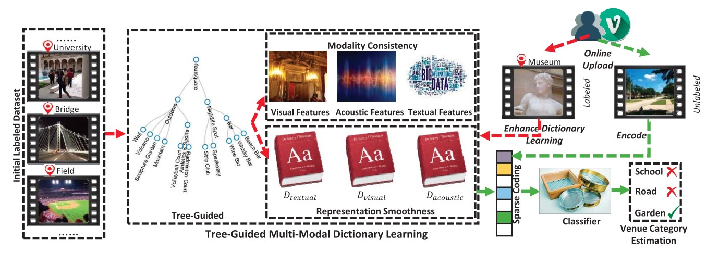
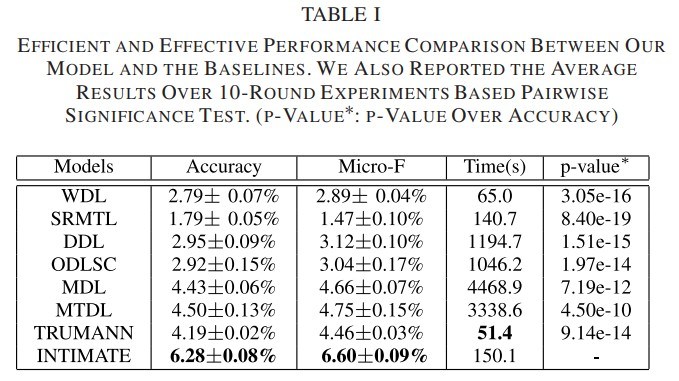

# Official Code for Online Data Organizer: Micro-video Categorization by Structure-guided Multimodal Dictionary Learning


## Introduction
Micro-videos have fast become one of the most dominant trends in the land of social media. Accordingly, how to organize them draws our attention. Distinct from the traditional long videos that would have multi-site scenes 
and tolerate the hysteresis, a microvideo: 1) usually records contents at one specific venue within a few seconds, whereby the venues are structured hierarchically regarding their category granularity. The geo-nature of micro-videos makes it possible to organize them via their venue structure. 2) demands timely propagation over social circles. Thus the timeliness of microvideos requires effective online processing. However, only 1.22% of micro-videos are labeled with venue information when uploaded at the mobile end. To address this problem, we present a framework to organize micro-videos online. In particular, we first build a structure-guided multi-modal dictionary learning model to learn the concept-level micro-video representation by jointly considering their venue structure and modality relatedness. We then develop an online learning algorithm to incrementally and efficiently strengthen our model, as well as categorize the micro-videos into a tree structure. Experiments on a real-world dataset validate our model well. In addition, we release the codes to facilitate other researchers.

## Dataset
In our work, we use the dataset proposed by the work of the paper "Shorter-is-Better: Venue Category Estimation from Micro-Video". They crawled the micro-videos from Vine through its public API (https://github.com/davoclavo/vinepy). In particular, they first manually chose a small set of active users from Vine as our seed users. They then adopted the breadth-first strategy to expand our user sets via gathering their followers. They terminated their expansion after three layers. For each collected user, they crawled his/her published videos, video descriptions and venue information if available. In such way, they harvested 2 million micro-videos. Thereinto, only about 24,000 micro-videos contain Foursquare check-in information. After removing the duplicate venue IDs, they further expanded their video set by crawling all videos in each venue ID with the help of vinepy API. This eventually yielded a dataset of 276,264 videos distributed in 442 Foursquare venue categories. Each venue ID was mapped to a venue category via the Foursquare API (https://developer.foursquare.com/categorytree), which serves as the ground truth.  And 99.8% of videos are shorter than 7 seconds. We have completed the missing data of the raw feature.

## Links
- **Paper**: [IEEE TIP](https://ieeexplore.ieee.org/abstract/document/8488491)
- **Code Download**: [Baidu Netdisk](https://pan.baidu.com/s/1KkjiDOVf5VHN6RBJ7DIROA)
- **Dataset Download**: [Baidu Netdisk](https://pan.baidu.com/s/1peq5SOElwRYWQLwhj9Nixw)

The code for several baseline methods:
- **Code Download**: [DDL](http://spams-devel.gforge.inria.fr/index.html)
- **Code Download**: [ODLSC](https://github.com/jamesgregson/matlab_dictionary_learning)
- **Code Download**: [SRMTL](http://www.public.asu.edu/~jye02/Software/MALSAR/)
- **Code Download**: [MTDL& MDL](https://github.com/soheilb/multimodal_dictionary_learning)
- **Code Download**: [TRUMANN](http://acmmm16.wixsite.com/mm16)
  
## Method Overview

<p align="center">
  
</p>


## Results

<p align="center">
  
</p>

Our method achieves competitive or superior results compared with previous methods on multiple benchmarks.

## License

Copyright (C) 2018 Shandong University

This program is licensed under the GNU General Public License v3.0.  
You may obtain a copy of the license at:  
https://www.gnu.org/licenses/gpl-3.0.html

Any derivative work based on this program must also be licensed under the GNU General Public License as published by the Free Software Foundation, either version 3 of the License, or (at your option) any later version, if such derivative work is distributed to a third party.

The copyright of this program is owned by Shandong University.

For commercial projects that require distributing this code as part of a program that cannot be released under the GNU General Public License, please contact `mengliu.sdu@gmail.com` to obtain a commercial license.

## Citation

If you find this project useful in your research, please consider citing:

```bibtex
@ARTICLE{8488491,
  author={Liu, Meng and Nie, Liqiang and Wang, Xiang and Tian, Qi and Chen, Baoquan},
  journal={IEEE Transactions on Image Processing}, 
  title={Online Data Organizer: Micro-Video Categorization by Structure-Guided Multimodal Dictionary Learning}, 
  year={2019},
  volume={28},
  number={3},
  pages={1235-1247}
  }
